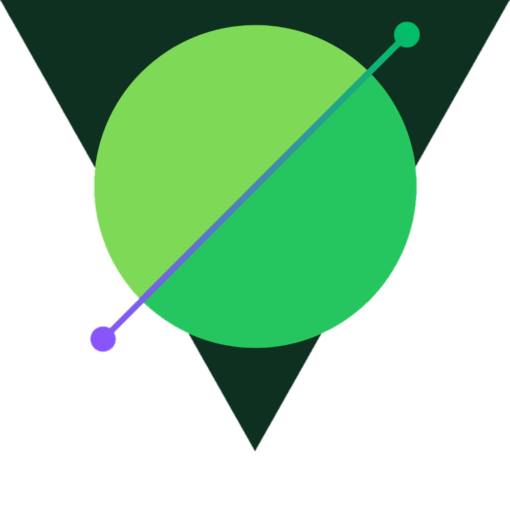

<p align="center">
  <a href="http://nestjs.com/" target="blank"></a>
</p>

<p align="center">
  <a href="https://coveralls.io/repos/github/NicolasCBV/echoguard/badge.svg?branch=develop" target="_blank">
    
  </a>

  <a href="https://img.shields.io/npm/v/echoguard?color=success" target="_blank">
    
  </a>

  <a href="https://img.shields.io/npm/l/echoguard" target="_blank">
    
  </a>

  <a href="https://www.linkedin.com/in/n%C3%ADcolas-cleiton-707688227/" target="_blank">
    
  </a>

  <a href="https://github.com/NicolasCBV" target="_blank">
    
  </a>

  <a href="https://portfolio-or1x.vercel.app/" target="_blank">
    
  </a>
</p>

# Echoguard

Welcome to the echoguard! This package was made to help you monitor your logs in development mode in nestjs applications!

## USAGE
Start your nestjs application and insert your server instance + the name of your application in this method below:

```
const app: NestExpressApplication =
await NestFactory.create<NestExpressApplication>(AppModule);

Echo.start({ server: app, appName: "<THE NAME OF YOUR APP>" });

await app.listen(3000);
```

After that, you will have one database installed on the root of your project, be sure to ignore that in your gitignore file. With this in mind, now you can create your logs as you need them using this method below:

```
Echo.create({
    name: 'some log',
    level: Logger.LogsLevelEnum.[THE LEVEL OF YOUR LOG],
    layer: 'where this log was launched (optional)',
    description: 'the description of this log'
});
```

Every time you access /logs, you will see all the logs created by this method.
